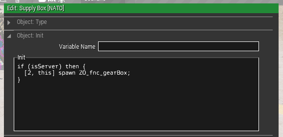
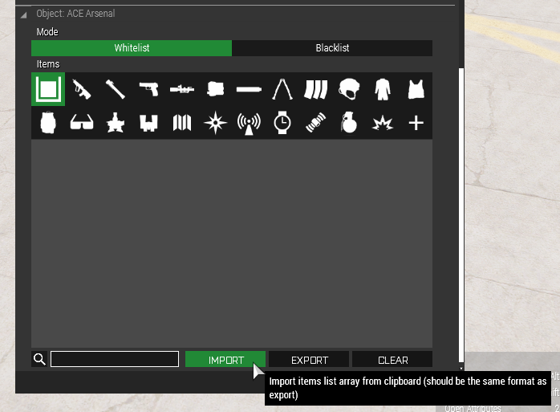

# Creating a limited arsenal

1. Place down an arsenal box (`Objects` -> `Props` -> `Supply Box [NATO]`)
2. Add the following to the object's init field:

   ```sqf
   if (isServer) then { 
     [2, this] spawn ZO_fnc_gearBox; 
   }
   ```

   

3. Select a faction of your choice from [limited-arsenal-factions](limited-arsenal-factions)
   (or pick [00-blank.txt](limited-arsenal-factions/00-blank.txt) for a template to build
   your own loadout)
4. Copy the content of the file to the clipboard and click `Object: ACE Arsenal` > `Import`:

   
5. Edit `initServer.sqf` and set `_fullArsenal = false`.

   **NOTE:** This will disable Full Arsenals on **all boxes** placed using the
   zeusops modules. You will need to manually use the ACE Arsenal module on a
   box if you want to create a separate full arsenal during a mission.
